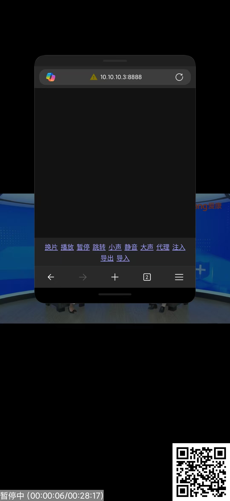

# 安卓视频播放器   

## 功能  
 
1. 实现最简单http服务器->手机扫码发送视频链接->服务端复制视频链接，并尝试调起系统播放器；  

## 使用方法   
1.  [从releases下载最新版本](https://github.com/qidizi/android-tv-player/releases);    
1.  安装至安卓电视;   
1.  运行本应用;  
1.  微信扫码后使用;  

## 正常使用的环境   
1.  avd android api 29  
1.  坚果投影仪m6 
  
## 效果图        

   

## 计划  

1.  升级提醒功能;  

## 更新历史   

### 2022.2.10  

1. 简化功能成外置播放器； 

### 2020.9.11  
1.  删除内置的电视播放列表; 
1.  优化缓存更新机制;  
1.  删除无用文件;  

### 2021.3.6  
1.  定位的ime+播放器简化为只做播放器;  
1.  初步实现播放视频链接、自动提取页面中m3u8视频链接、扫码控制;  

### 2021.4.20  
1.  显示ip  
1.  仅保留播放按钮，隐藏其它  

