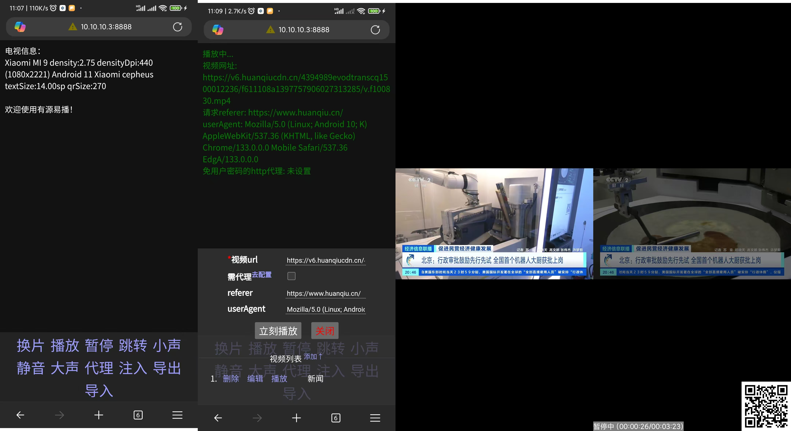

# 安卓视频播放器   

## 功能  
 
1. 手机扫码推送视频url给tv播放
2. 暂停/播放
3. 增/减/静音（app必须是当前窗口）
4. 视频可选走代理
5. 注入js扩展。如使用在线js功能
6. js请求他源text。如获取第三方列表
7. js head他源url。如检测第三方列表中链接是否可用
8. 进度跳转
9. 列表管理（浏览器端）
10. 配置导入/导出
11. 遥控器确认为播放/暂停、左右快进

## 使用方法   
1. [从releases下载最新版本](https://github.com/qidizi/android-tv-player/releases);    
2. 安装至安卓电视;
3. 运行本应用;  
4. 微信扫码后使用;  

## 设备要求
android 7.0 或以上
  
## 效果图        

  

## 计划  

1.  升级提醒功能;  

## 更新历史  

### 2025.2.25
1. 换成exoPlayer 

## 编译

1. android studio

直接点击run按钮

2. termux

cd到本目录，运行 `bash run.sh` 